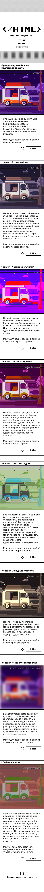
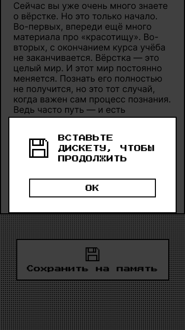
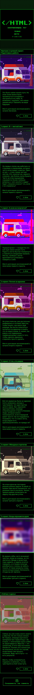
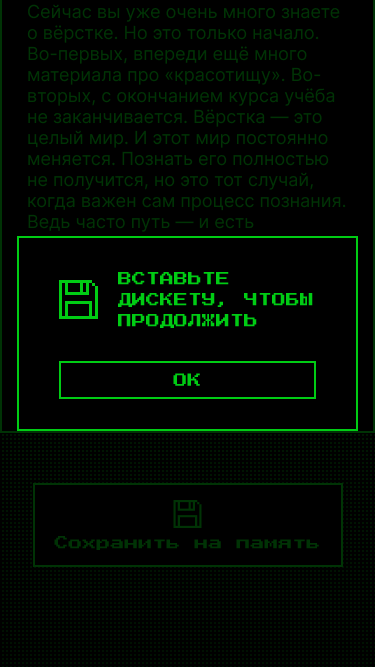
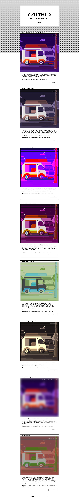
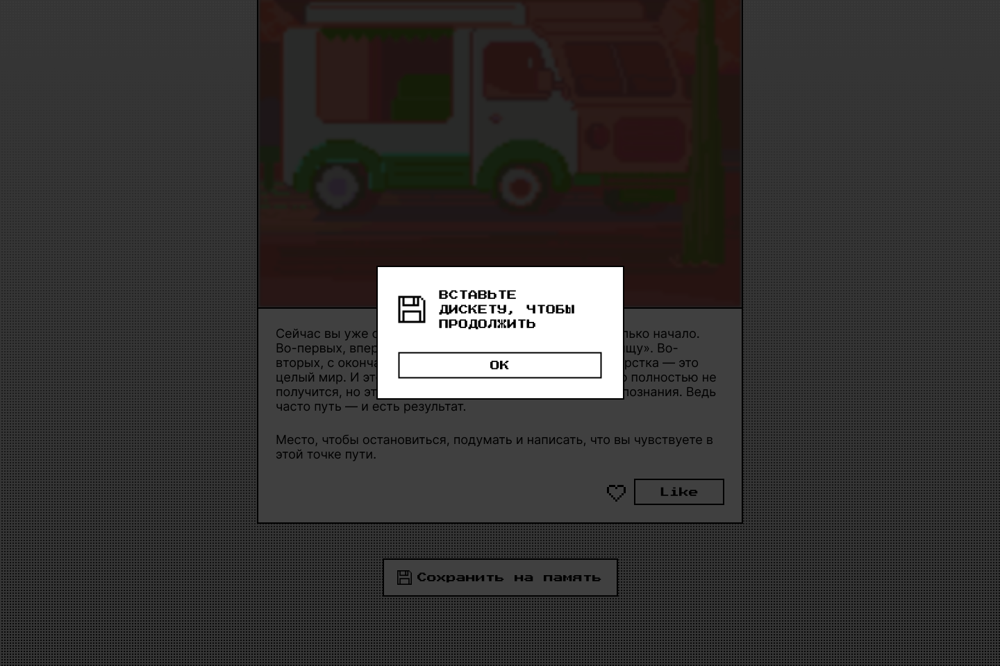
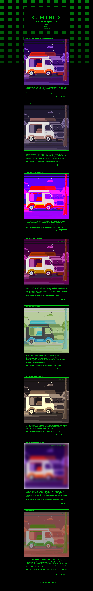
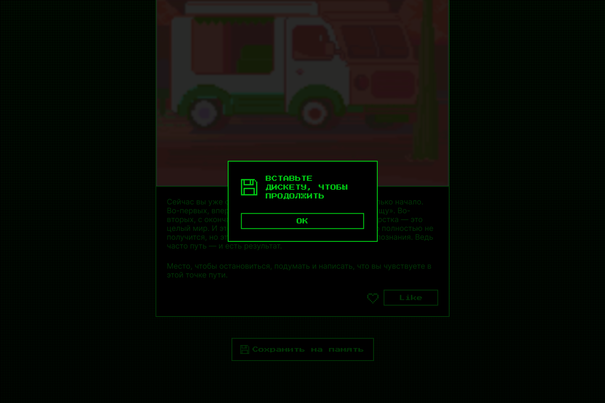
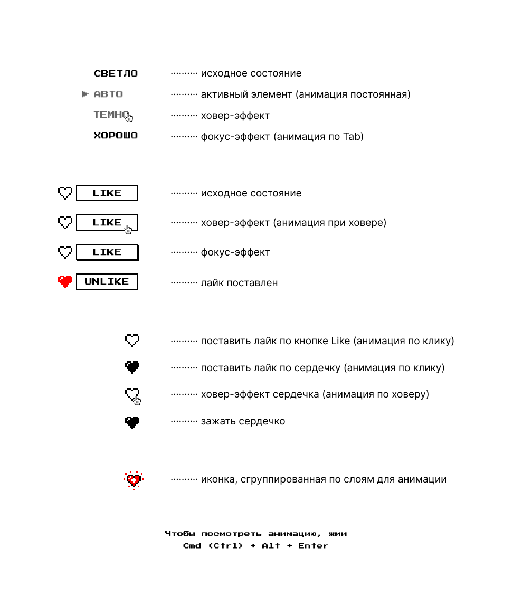

# zakrivayuschiy-teg-f

https://github.com/StRaiGT/zakrivayuschiy-teg-f

### Описание
4.1 Адаптивная верстка веб-страницы по макету с использованием переменных, состояний и анимации. 
Реализовано переключение между светлой и темной темами.

### Стек:
- HTML и CSS

[Ссылка на макет](https://www.figma.com/file/JQhPLs2COLIeZtAtlsBS34/%238-%3C%2F%D0%B7%D0%B0%D0%BA%D1%80%D1%8B%D0%B2%D0%B0%D1%8E%D1%89%D0%B8%D0%B9-%D1%82%D0%B5%D0%B3%3E?type=design&node-id=801-609&mode=design&t=RnvgdNiSiaXDQE4b-0)

